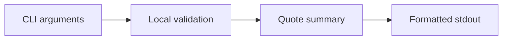

# CLI Command Map

本文是 `qtcloud-business` CLI 的命令结构图，记录当前有哪些命令、它们做什么，以及后续准备怎么扩展。

## 当前命令

### `status`

- 读取本地商务状态快照。
- 只负责展示，不修改数据。

### `quote`

- 只做本地报价计算，不存储，不调服务端。
- 目前有两种模式：
  - 工时报价：`--hours`、`--level`、`--premium`
  - 明细报价：`--example retrospective` 或 `--project`、`--client`、可重复 `--item`、`--note`

## 数据流

## 约束

- 工时参数和明细参数不能混用。
- 明细报价的金额、数量和折扣会先做本地校验。
- `quote --example retrospective` 是预置样例，不接受额外覆盖参数。

## 未来扩展

- 把 quote 计算核心抽出来，供 CLI 和服务端共用。
- 给 quote 增加持久化和历史记录。
- 未来服务端上线后，CLI 可以切到服务层调用。
